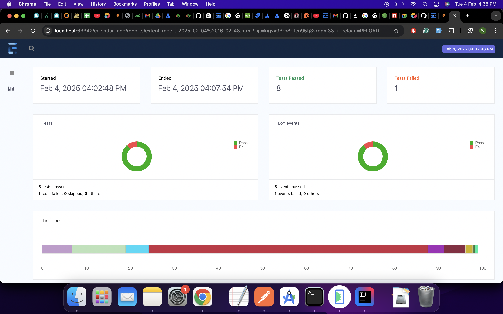
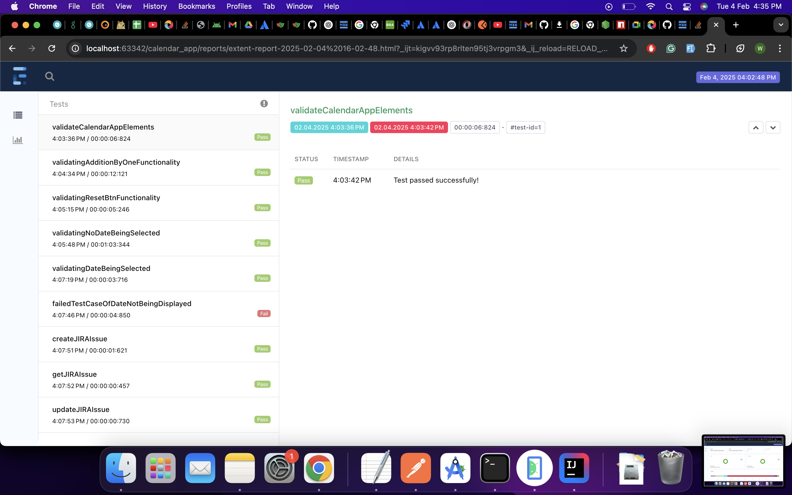

# Counter App Automation And API Automation

## Overview:- 
Following project consist of two parts;

1. Mobile Automation Using Appium with JAVA
2. API Automation using playwright

## Testing Coverage

For mobile automation the coverage consists of automation of the counter app basic functionalities that include;
1. Opening the application and validating its initial state
2. Verifying the counter increment functionality
3. Verifying Calendar and date picker functionality
4. Verifying the post-operation after date picker success and failure

For API Testing, the coverage consists of the automation of CRUD operations of JIRA using JIRA Public apis
1. Creation of JIRA Issue
2. Fetching of the created issue
3. Updating of the fetched issue

## Pre-automation Configuration
1. Setting up JAVA_HOME
2. Setting up Android_SDK and Android_home
3. Installing HomeBrew, Node and NPM
4. Installing android studio for Emulator and getting Android_Sdk
5. IDE (intelli j)
6. Installing Appium, UIAutomator2 and Appium inspector

## Dependencies Used
1. TestNg
2. Appium
3. Playwright
4. JsonReader
5. ExtentReport

## Project Structure
Src/Main/Java contains:
1. base directory consisting of BaseClass for API and Mobile respectively. Each Class has their own annotations that are run for the type of testsuite that has to be run i.e. API/Mobile
2. config directory contains config reader that is reading configurations from application.properties
3. driver.appium directory contains appium driver factory that consists of methods that will start the appium service, assign the capabilities that will be used by the android driver and setter and getter functions of drivers
4. testExecution directory contains the tests files themselves and their implementations segregated by different directories
5. utility directory contains; common method class for api and mobile, assertion class for mobile and api and Test listener class

Src/Main/Resources contains:
1. payloads stored separately for the api requests that require them
2. the application apk
3. Application properties

## Test Execution:

1. Start the appium server via the terminal
2. Open the device emulator or connect the device
3. In the application.properties set the name of the said device or emulator for the Key= android_device_name
4. Go to testng.xml file in the project structure and run the test cases by running the **testng.xml** file

# Execution Result:

## ScreenShots:

## ScreenRecording:
[Screen Recording 2025-02-04 at 2.22.12 PM.mov](EvidenceOfTheTestRun/Screen%20Recording%202025-02-04%20at%202.22.12%20PM.mov)
